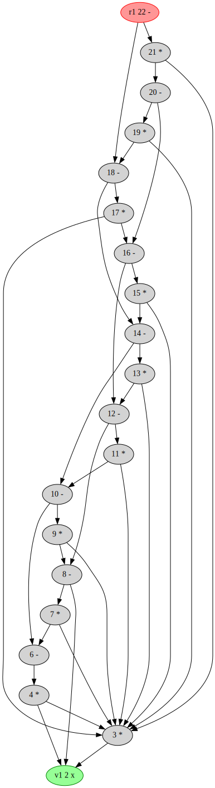
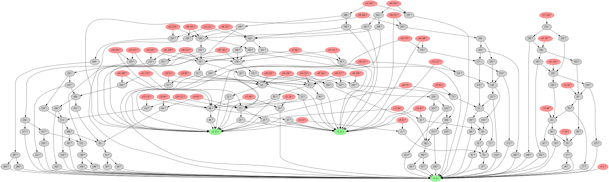

# FastSymbolicDifferentiation

[](https://github.com/brianguenter/FastSymbolicDifferentiation.jl/actions/workflows/CI.yml?query=branch%3Amain)

This package is not yet on the Julia registry and is currently Beta software. I hope to have it registered in a few weeks. Come back then for better documentation, fewer bugs, and more features.

This is a package for computing symbolic derivatives quickly and for generating efficient executables to evaluate those derivatives. It uses a new algorithm, called **FSD**, which is related to the [D* ](https://www.microsoft.com/en-us/research/publication/the-d-symbolic-differentiation-algorithm/) algorithm but is asymptotically  faster.  

For expression graphs with many common subexpressions (where each node in the expression graph has more than one parent on average) **FSD** may compute symbolic derivatives much more quickly than conventional computer algegra systems such as Symbolics.jl or Mathematica. The generated executables may also be significantly faster. 

If your function is small or tree like (where each node in the expression graph has one parent on average) then Symbolics.jl may outperform **FSD**. There is no simple rule to determine whether **FSD** will do better than Symbolics.jl. Try them both and choose the faster one.

**FSD** can be used standalone if all you need is a derivative or with Symbolics.jl if you need to do further analysis on the symbolic derivative. Converting between Symbolics.jl and **FSD** expression forms is straightforward. However, because of the tree based representation used by Symbolics.jl expression size can grow significantly when converting from **FSD** to Symbolics.jl forms.


Unlike forward and reverse automatic differentiation you don't have to choose which differentiation algorithm to use based on the graph structure. **FSD** automatically generates efficient derivatives for arbitrary function types: ℝ¹->ℝ¹, ℝ¹->ℝᵐ, ℝⁿ->ℝ¹, and ℝⁿ->ℝᵐ, m≠1,n≠1. Its efficiency comes from analysis of the graph structure of the function rather than sophisticated algebraic simplification rules. By default **FSD** applies only these algebraic simplications[^1] to expressions:
* x×0=>0
* x×1=>x
* x/1=>x
* x+0=>x
* c₁×c₂=>c₃ for c₁,c₂,c₃ constants
* c₁+c₂=>c₃ for c₁,c₂,c₃ constants
* c₁×(c₂×x) => (c₁×c₂)×x  for c₁,c₂ constants


These rules are generally safe in the sense of obeying IEEE floating point arithmetic rules. However if the runtime value of x happens to be NaN or Inf the **FSD** expression x*0 will identically return 0, because it will have been rewritten to 0 by the simplification rules. The expected IEEE result is NaN. The expected IEEE result for x+0 is NaN when x is NaN, and Inf when x is Inf. But the **FSD** result will be identically zero because the expression will have been rewritten to 0.

## Future work
The **FSD** algorithm is fast enough to differentiate large expression graphs (>10⁵ operations) but the LLVM compiler has difficulty compiling the large functions that result. Compile time rises dramatically and out of memory errors are common. For these very large graphs I hope to use [DynamicExpressions.jl](https://github.com/SymbolicML/DynamicExpressions.jl). The function generation time should be acceptable and runtime performance should be good, if not as fast as fully compiled code

The code currently uses BitVector for tracking reachability of function roots and variable nodes. This seemed like a good idea when I began and thought **FSD** would only be practical for modest size graphs (<10⁴ nodes). Unfortunately, for larger graphs the memory overhead of the BitVector representation becomes significant. It should be possible to automatically detect when it would make sense to switch from BitVector to Set. Then it will be possible to differentiate significantly larger graphs than is currently feasible.

The current code can only differentiate symbolic expressions without branches. However, the **FSD** algorithm is fast enough that it should be practical to use it in a tracing JIT compiler, applying **FSD** to the basic blocks detected and compiled by the JIT. Many programs could be differentiated competely automatically by this method. I'm not a compiler expert so it is unlikely I will do this by myself. But contact me if *you* are a compiler expert and want a cool project to work on.

<details> 
 <summary> Examples and basic usage </summary>
 
There are several ways to use FastSymbolicDifferentiation. You can do all your symbolic work, except differentiation, in Symbolics and then convert to **FSD** graph form just to do the differentiation. Or you can do everything in FastSymbolicDifferentiaton: create **FSD** variables, make an expression using those variables and then differentiate it. You can then convert this derivative to Symbolics form if you need to do further symbolic processing. 

Because Symbolics uses a tree representation and FastSymbolicDifferentiation uses a graph representation it is possible that converting from FastSymbolicDifferentiation->Symbolic could result in an exponential increase in the size of the expression.

If all you need is a derivative function then the fastest workflow will be to do everything in **FSD**. 

Set up variables:
```
using FastSymbolicDifferentiation
using Symbolics

@variables x y z

julia> nx,ny,nz = Node.((x,y,z)) #create FastSymbolicDifferentiation variables.
(x, y, z)
```
Compute Hessian:
```
julia> hessian(nx^2+ny^2+nz^2,[nx,ny,nz])
3×3 Matrix{Node}:
 2    0.0  0.0
 0.0  2    0.0
 0.0  0.0  2

 julia> hessian(nx*ny*nz,[nx,ny,nz])
 3×3 Matrix{Node}:
  0.0  z    y
  z    0.0  x
  y    x    0.0
```
Compute Jacobian:
```
julia> f1,f2 = cos(nx) * ny, sin(ny) * nx

julia> gr = DerivativeGraph([f1, f2]);

julia> symb = symbolic_jacobian(gr) #non-destructive. Use this when memory is an issue 
# and you don't want to copy the input graph. 
# This version of the function orders the derivatives in the order they happen to appear in the 
# variables data structure of graph which is unpredictable.
2×2 Matrix{Node}:
 (y * -(sin(x)))  cos(x)
 sin(y)           (x * cos(y))

julia> symb = symbolic_jacobian(gr,[ny,nx]) #Adding the optional argument for variable ordering
#allows you to precisely control where the 
#partial derivatives will appear in the jacobian
2×2 Matrix{Node}:
 cos(x)        (y * -(sin(x)))
 (x * cos(y))  sin(y)
```
Generate executable function that evaluates derivative function:
```
julia> func = jacobian_function(gr, [nx, ny]); #non-destructive form. Use this 
#when memory is an issue and you don't want to copy the input graph.

julia> func(1.0, 2.0)
2×2 Matrix{Float64}:
 -1.68294    0.540302
  0.909297  -0.416147
```
Convert between FastSymbolicDifferentiation and Symbolics representations:
```
julia> f = x^2+y^2 #Symbolics expression
x^2 + y^2

julia> Node(f) #convert to FastSymbolicDifferentiation form
x^2 + y^2

julia> typeof(ans)
Node{SymbolicUtils.BasicSymbolic{Real}, 0}

julia> node_exp = nx^3/ny^4 #FastSymbolicDifferentiation expression
((x ^ 3) / (y ^ 4))

julia> dag_to_Symbolics_expression(node_exp)
(x^3) / (y^4)

julia> typeof(ans)
Symbolics.Num
```
</details>

<details>
    <summary> Benchmarks </summary>
 
## Benchmarks

The **FSDBenchmark** subdirectory has several benchmark functions you can use to compare the performance of [Symbolics.jl](https://symbolics.juliasymbolics.org/dev/) to FastSymbolicDifferentiation.jl on your computer. There are three types of benchmarks: Symbolic, MakeFunction, and Exe. 

The **Symbolic** benchmark is the time required to compute just the symbolic form of the derivative. The Symbolic benchmark can be run with simplification turned on or off for Symbolics.jl. If simplification is on then computation time can be extremely long but the resulting expression might be simpler and faster to execute.

The **MakeFunction** benchmark is the time to generate a Julia Expr from an already computed symbolic derivative and to then compile it. As symbolic expressions become large LLVM compile time and memory usage both increase dramatically. For both of the example benchmarks shown below LLVM ran out of memory at relatively small problem sizes.

The **Exe** benchmark measures just the time required to execute the compiled function using an in-place matrix.

All benchmarks show the ratio of time taken by Symbolics.jl to FastSymbolicDifferentiation.jl. Numbers greater than 1 mean FastSymbolicDifferentiation is faster.

All benchmarks were run on an AMD Ryzen 9 7950X 16-Core Processor with 32GB RAM running Windows 11 OS, Julia version 1.9.0.
### Chebyshev polynomial
The first example is a recursive function for 
the Chebyshev polynomial of order n:

```
@memoize function Chebyshev(n, x)
    if n == 0
        return 1
    elseif n == 1
        return x
    else
        return 2 * (x) * Chebyshev(n - 1, x) - Chebyshev(n - 2, x)
    end
end
```
The function is memoized for efficiency. 

The Chebyshev expression graph does not have many nodes even at the largest size tested (graph size increases linearly with Chebyshev order). For example, here is the graph of the 10th order expression: 

The complexity arises from the number of different paths from the root to the leaf of the graph.

Symbolics.jl can simplify the resulting expression graphs to a simple polynomial form when full simplification is turned on. This yields efficient executables but the symbolic processing can take a very long time. The first set of three benchmarks show results with simplification turned off in Symbolics.jl, followed by a set of three with simplification turned on.

#### Chebyshev benchmarks with simplification off
 

 
 For the Chebyshev MakeFunction benchmark the Symbolics.jl derivative generated a large Expr for order 20 and higher. LLVM ran out of memory while compiling these. Consequently, both the MakeFunction and Exe graphs stop at order 20.
 


#### Chebyshev benchmarks with simplification on

### Spherical Harmonics

The second example is the spherical harmonics function. This is the expression graph for the spherical harmonic function of order 8:


<details>
    <summary> Source for spherical harmonics benchmark </summary>

```
@memoize function P(l, m, z)
    if l == 0 && m == 0
        return 1.0
    elseif l == m
        return (1 - 2m) * P(m - 1, m - 1, z)
    elseif l == m + 1
        return (2m + 1) * z * P(m, m, z)
    else
        return ((2l - 1) / (l - m) * z * P(l - 1, m, z) - (l + m - 1) / (l - m) * P(l - 2, m, z))
    end
end
export P

@memoize function S(m, x, y)
    if m == 0
        return 0
    else
        return x * C(m - 1, x, y) - y * S(m - 1, x, y)
    end
end
export S

@memoize function C(m, x, y)
    if m == 0
        return 1
    else
        return x * S(m - 1, x, y) + y * C(m - 1, x, y)
    end
end
export C

function factorial_approximation(x)
    local n1 = x
    sqrt(2 * π * n1) * (n1 / ℯ * sqrt(n1 * sinh(1 / n1) + 1 / (810 * n1^6)))^n1
end
export factorial_approximation

function compare_factorial_approximation()
    for n in 1:30
        println("n $n relative error $((factorial(big(n))-factorial_approximation(n))/factorial(big(n)))")
    end
end
export compare_factorial_approximation

@memoize function N(l, m)
    @assert m >= 0
    if m == 0
        return sqrt((2l + 1 / (4π)))
    else
        # return sqrt((2l+1)/2π * factorial(big(l-m))/factorial(big(l+m)))
        #use factorial_approximation instead of factorial because the latter does not use Stirlings approximation for large n. Get error for n > 2 unless using BigInt but if use BigInt get lots of rational numbers in symbolic result.
        return sqrt((2l + 1) / 2π * factorial_approximation(l - m) / factorial_approximation(l + m))
    end
end
export N

"""l is the order of the spherical harmonic. I think"""
@memoize function Y(l, m, x, y, z)
    @assert l >= 0
    @assert abs(m) <= l
    if m < 0
        return N(l, abs(m)) * P(l, abs(m), z) * S(abs(m), x, y)
    else
        return N(l, m) * P(l, m, z) * C(m, x, y)
    end
end
export Y

SHFunctions(max_l, x::Node, y::Node, z::Node) = SHFunctions(Vector{Node}(undef, 0), max_l, x, y, z)
SHFunctions(max_l, x::Symbolics.Num, y::Symbolics.Num, z::Symbolics.Num) = SHFunctions(Vector{Symbolics.Num}(undef, 0), max_l, x, y, z)

function SHFunctions(shfunc, max_l, x, y, z)
    for l in 0:max_l-1
        for m in -l:l
            push!(shfunc, Y(l, m, x, y, z))
        end
    end

    return shfunc
end
export SHFunctions

function spherical_harmonics(::JuliaSymbolics, model_size)
    Symbolics.@variables x y z
    return SHFunctions(model_size, x, y, z), [x, y, z]
end

function spherical_harmonics(::FastSymbolic, model_size, x, y, z)
    nx = Node(x)
    ny = Node(y)
    nz = Node(z)

    graph = DerivativeGraph(SHFunctions(model_size, nx, ny, nz))
    return graph
end

function spherical_harmonics(package::FastSymbolic, model_size)
    Symbolics.@variables x, y, z
    return spherical_harmonics(package, model_size, x, y, z)
end
export spherical_harmonics
```
</details>

As was the case for Chebyshev polynomials the number of paths from the roots to the variables is much greater than the number of nodes in the graph. 

These benchmarks took significantly longer to run than the Chebyshev benchmarks (6 minutes to benchmark order 25 spherical harmonic for Symbolics.jl) so the problem sizes are not as large and the ratios of time taken by Symbolics.jl vs. FastSymbolicDifferentiation.jl are not as large. 

But, one can reasonably expect for larger problem instances that the relative advantage of FastSymbolicDifferentiation.jl vs Symbolics.jl would increase.

[comment]: # ()
[comment]: # ()
[comment]: # ()

For the Symbolics.jl Exe benchmark LLVM ran out of memory for order 16 or higher.
</details>

[^1]: More rules may be added in future versions of FSD to improve efficiency.
